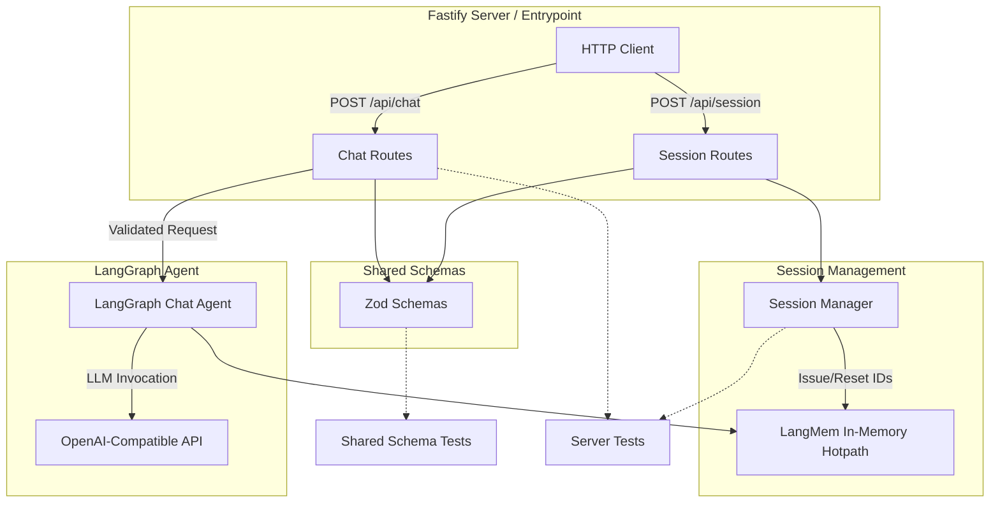

# Backend Architecture

```mermaid
graph TD
  subgraph FastifyServer[Fastify Server / Entrypoint]
    A[HTTP Client] -->|POST /api/session| SRoutes[Session Routes]
    A -->|POST /api/chat| CRoutes[Chat Routes]
  end

  subgraph SessionLayer[Session Management]
    SRoutes --> SM[Session Manager]
    SM -->|Issue/Reset IDs| LangMemStore[LangMem In-Memory Hotpath]
  end

  subgraph AgentLayer[LangGraph Agent]
    CRoutes -->|Validated Request| AgentFactory[LangGraph Chat Agent]
    AgentFactory --> LangMemStore
    AgentFactory -->|LLM Invocation| OpenAICompat[OpenAI-Compatible API]
  end

  subgraph SharedSchemas[Shared Schemas]
    CRoutes --> Schemas[Zod Schemas]
    SRoutes --> Schemas
  end

  Schemas -.-> TestsShared[Shared Schema Tests]
  SM -.-> TestsServer[Server Tests]
  CRoutes -.-> TestsServer

  click SRoutes "../../apps/server/src/session/routes.ts" "Session Routes"
  click CRoutes "../../apps/server/src/chat/routes.ts" "Chat Routes"
  click SM "../../apps/server/src/session/session-manager.ts" "createSessionManager"
  click LangMemStore "../../apps/server/src/agent/memory.ts" "InMemoryLangMem"
  click AgentFactory "../../apps/server/src/agent/langgraph-agent.ts" "createLangGraphChatAgent"
  click Schemas "../../packages/chat-shared/src" "Shared Zod Schemas"
  click TestsShared "../../packages/chat-shared/__tests__/chat-schema.test.ts" "Shared Schema Tests"
  click TestsServer "../../apps/server/src/session/__tests__/session.routes.test.ts" "Session Route Tests"
```
