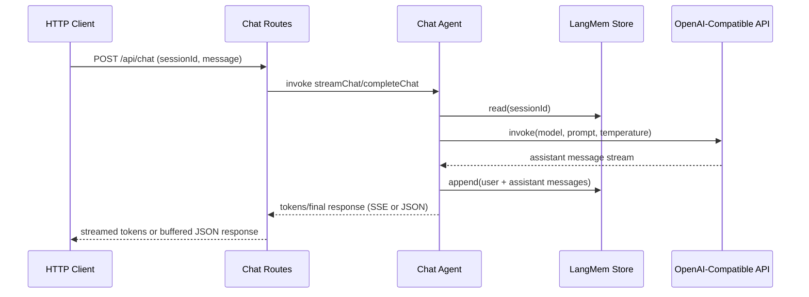

# LangGraph Chat Agent Sequence

- Request validation uses shared Zod schemas ([`packages/chat-shared/src`](../../packages/chat-shared/src)).
- Session IDs and resets go through [`createSessionManager`](../../apps/server/src/session/session-manager.ts).
- Logging and invocation flow lives inside [`LangGraphChatAgent`](../../apps/server/src/agent/langgraph-agent.ts) and the Fastify bootstrap.
