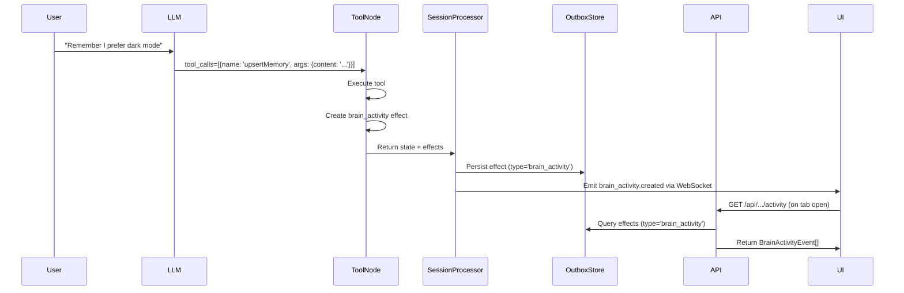
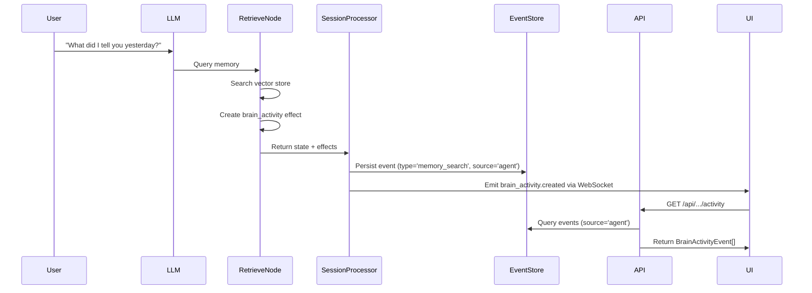

# Data Model: Agent Brain Activity Transparency

**Phase**: 1 (Design & Contracts)  
**Date**: 2025-11-11  
**Purpose**: Define entities, relationships, validation rules, and state transitions

## Core Entities

### BrainActivityEvent (TypeScript type, not persisted as single entity)

**Purpose**: Unified view of agent decision-making events sourced from Event + Effect tables

**Attributes**:
- `id: string` - UUID (from source Event or Effect)
- `threadId: string` - Thread context (for filtering, access control)
- `agentId: string` - Agent that generated the event (for multi-agent threads)
- `timestamp: Date` - When the event occurred (from createdAt)
- `eventType: 'tool_call' | 'memory_search' | 'context_pruned' | 'schedule_timer'` - Discriminated union tag
- `source: 'user' | 'agent' | 'system'` - Event originator (from Event.source or inferred as 'agent' for Effects)
- `payload: BrainActivityPayload` - Type-specific data (discriminated by eventType)

**Relationships**:
- Belongs to Thread (threadId foreign key)
- Belongs to Agent (agentId foreign key)
- Sourced from Event OR Effect table (not both)

**Validation Rules**:
- `id` must be valid UUID
- `threadId` must reference existing thread
- `agentId` must reference existing agent
- `timestamp` must not be in the future
- `eventType` determines payload shape (TypeScript discriminated union enforces this)
- `source` must be one of: 'user', 'agent', 'system'

**State Transitions**: None (immutable once created, FR-021)

**Storage Strategy**: Virtual entity constructed via BrainActivityDecorator from:
- Event table (for `memory_search`, `context_pruned` with `source='agent'`)
- Effect table (for `tool_call`, `schedule_timer`)

---

### Event (Prisma model, MODIFIED)

**Purpose**: Record user actions, agent observations, and system events in sequential log

**Existing Attributes**:
- `id: string` - UUID, primary key
- `sessionKey: string` - Session identifier (thread + checkpoint context)
- `seq: number` - Sequence number within session
- `type: string` - Event type ('user_message', 'timer', 'memory_search', 'context_pruned')
- `payload: Json` - Event-specific data
- `createdAt: DateTime` - Timestamp

**NEW Attributes**:
- `source: EventSource` - Event originator (USER|AGENT|SYSTEM), default=USER

**NEW Enum**:
```prisma
enum EventSource {
  USER     // User-initiated events (user_message)
  AGENT    // Agent-generated observations (memory_search, context_pruned)
  SYSTEM   // System-generated events (timer, lifecycle)
}
```

**Indexes**:
- ✅ Existing: `(sessionKey, seq)` unique, `(sessionKey)`, `(createdAt)`
- 🆕 NEW: `(source)` - For filtering agent-generated events
- 🆕 NEW: `(sessionKey, source, createdAt)` - Composite for brain activity queries

**Relationships**:
- Belongs to Session (sessionKey)
- Queried by BrainActivityDecorator when `source='agent'` and `type IN ('memory_search', 'context_pruned')`

**Validation Rules**:
- `sessionKey` must not be empty
- `seq` must be non-negative, unique within session
- `source` must be valid EventSource enum value
- `type` determines expected payload shape (Zod schema validation)
- `createdAt` set by database, immutable

**State Transitions**: None (append-only log, Event Sourcing pattern)

**Brain Activity Relevance**:
- Events with `source='agent'` and `type='memory_search'` → BrainActivityEvent(eventType='memory_search')
- Events with `source='agent'` and `type='context_pruned'` → BrainActivityEvent(eventType='context_pruned')

---

### Effect (Prisma model, EXISTING)

**Purpose**: Commands to be executed by EffectRunner (send messages, schedule timers, etc.)

**Relevant Attributes** (for brain activity):
- `id: string` - UUID, primary key
- `sessionKey: string` - Session identifier
- `type: string` - Effect type ('send_message', 'schedule_timer', 'brain_activity')
- `payload: Json` - Effect-specific data
- `status: string` - Execution status ('pending', 'completed', 'failed')
- `createdAt: DateTime` - Timestamp
- `dedupeKey: string?` - Optional deduplication key

**Indexes**:
- ✅ Existing: `(sessionKey, status)`, `(status, createdAt)`
- 🆕 Recommended: `(sessionKey, type, createdAt)` - For brain activity queries (if not exists)

**Relationships**:
- Belongs to Session (sessionKey)
- Queried by BrainActivityDecorator when `type='brain_activity'` and `payload.eventType IN ('tool_call', 'schedule_timer')`

**Validation Rules**:
- `sessionKey` must not be empty
- `type` must be valid effect type
- `status` must be one of: 'pending', 'completed', 'failed'
- `payload` structure determined by type (Zod schema validation)

**State Transitions**:
- `pending` → `completed` (after successful execution)
- `pending` → `failed` (after execution error)
- Brain activity effects remain `pending` (no execution needed, they're observations)

**Brain Activity Relevance**:
- Effects with `type='brain_activity'` and `payload.eventType='tool_call'` → BrainActivityEvent(eventType='tool_call')
- Effects with `type='schedule_timer'` → BrainActivityEvent(eventType='schedule_timer')

---

## Payload Schemas (TypeScript discriminated unions)

### BrainActivityPayload (Union Type)

**Discriminator**: `eventType` field determines payload shape

#### ToolCallPayload

```typescript
{
  eventType: 'tool_call',
  toolName: 'upsertMemory',  // Currently only registered tool
  arguments: Record<string, unknown>,  // Tool-specific args (content, metadata, key for upsertMemory)
  result?: unknown,  // Tool return value (success: boolean, memoryId: string, message: string)
  duration?: number  // Execution time in milliseconds
}
```

**Validation**:
- `toolName` must match registered tool in `memoryTools` array (currently: 'upsertMemory')
- `arguments` validated against tool's Zod schema (UpsertMemoryInputSchema)
- `result` optional (may not be available if tool call in progress)
- `duration` optional, non-negative if present

#### MemorySearchPayload

```typescript
{
  eventType: 'memory_search',
  query: string,  // Search query text
  retrievedCount: number,  // Number of memories retrieved
  memoryIds: string[]  // UUIDs of retrieved memories
}
```

**Validation**:
- `query` must not be empty
- `retrievedCount` must match `memoryIds.length`
- `memoryIds` must be valid UUIDs

#### ContextPrunedPayload

```typescript
{
  eventType: 'context_pruned',
  messagesRemoved: number,  // Count of messages pruned
  summaryGenerated: string,  // Summary text
  compressionRatio: number  // messagesRemoved / summaryTokenCount
}
```

**Validation**:
- `messagesRemoved` must be positive
- `summaryGenerated` must not be empty
- `compressionRatio` must be positive (summary should be shorter than original)

#### ScheduleTimerPayload

```typescript
{
  eventType: 'schedule_timer',
  followUpTime: string,  // ISO8601 timestamp
  reasoning: string,  // LLM's explanation for scheduling
  autonomyDecision: boolean  // True if agent decided to follow up
}
```

**Validation**:
- `followUpTime` must be valid ISO8601 date, in the future
- `reasoning` must not be empty
- `autonomyDecision` typically true (false for "no_followup_needed" events)

---

## Entity Lifecycle

### BrainActivityEvent Creation Flow

**1. Tool Call (upsertMemory)**



**2. Memory Search**



**Note**: Context pruning and autonomy decisions follow similar patterns (graph node → effect → SessionProcessor → EventStore/OutboxStore → WebSocket → UI)

---

## Access Control

**Rule**: Brain activity events respect agent-scoped access control (FR-015)

**Implementation**:
- API endpoint `/api/agents/:agentId/threads/:threadId/activity` filters by agentId
- Query: `WHERE Event.sessionKey LIKE 'thread-{threadId}-%' AND ... (infer agentId from session or explicit filter)`
- UI: ActivityList only displays events for currently active agent

**Rationale**: Same pattern as memory access control (agents can only view their own memories, agents can only view their own brain activity)

---

## Performance Considerations

### Query Optimization

**Parallel Query Pattern**:
```typescript
const [agentEvents, brainEffects] = await Promise.all([
  prisma.event.findMany({
    where: {
      sessionKey: { startsWith: `thread-${threadId}-` },
      source: 'AGENT',
      type: { in: ['memory_search', 'context_pruned'] }
    },
    orderBy: { createdAt: 'desc' },
    take: limit,
    skip: offset
  }),
  prisma.effect.findMany({
    where: {
      sessionKey: { startsWith: `thread-${threadId}-` },
      type: { in: ['brain_activity', 'schedule_timer'] }
    },
    orderBy: { createdAt: 'desc' },
    take: limit,
    skip: offset
  })
]);
```

**Index Usage**:
- Event query uses: `(sessionKey, source, createdAt)` composite index
- Effect query uses: `(sessionKey, type, createdAt)` composite index
- Both queries sorted by createdAt (index scan, no external sort needed)

**Expected Performance** (per SC-003):
- 90% of queries <200ms for 50-100 events
- Pagination limits network transfer (default 50, max 200)
- Virtual scrolling in UI prevents DOM bloat

### Storage Growth

**Retention Policy** (FR-018):
- Brain activity events retained indefinitely (matches conversation message retention)
- No automatic pruning (monitor database size, implement archival in future spec if needed)

**Estimated Growth** (per thread):
- Tool calls: 1-5 per conversation (infrequent, upsertMemory only)
- Memory searches: 5-20 per conversation (every user query triggers search)
- Context pruning: 1-3 per conversation (only in long threads >20 messages)
- Autonomy: 0-2 per conversation (opt-in feature, infrequent)
- **Total**: ~10-30 events per thread
- **Payload size**: 500 bytes average (JSON)
- **100 threads**: ~3 MB brain activity data (negligible)

---

## Migration Checklist

- [ ] Create Prisma migration: `pnpm prisma migrate dev --name add_event_source`
- [ ] Verify migration SQL: Check DEFAULT value, indexes
- [ ] Apply migration to dev database
- [ ] Update EventStore.create() calls to set `source: 'agent'` for brain activity
- [ ] Run Postgres validation test: Verify Event.source column exists and queries work
- [ ] Document rollback procedure in migration notes
