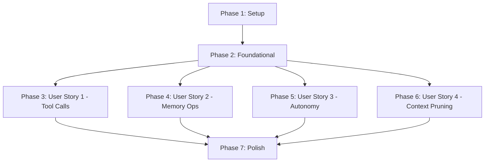

# Tasks: Agent Brain Activity Transparency

**Input**: Design documents from `/specs/017-agent-brain/`
**Prerequisites**: plan.md ✅, spec.md ✅, research.md ✅, data-model.md ✅, contracts/ ✅

**Organization**: Tasks are grouped by user story to enable independent implementation and testing of each story.

## Format: `[ID] [P?] [Story] Description`

- **[P]**: Can run in parallel (different files, no dependencies)
- **[Story]**: Which user story this task belongs to (e.g., US1, US2, US3, US4)
- Include exact file paths in descriptions

## Phase 1: Setup (Shared Infrastructure)

**Purpose**: Database migration and shared TypeScript types

- [ ] T001 Create Prisma migration for EventSource enum in prisma/schema.prisma
- [ ] T002 Add EventSource enum (USER, AGENT, SYSTEM) to prisma/schema.prisma
- [ ] T003 Add source column to Event model with @default(USER) in prisma/schema.prisma
- [ ] T004 Add index on Event.source column in prisma/schema.prisma
- [ ] T005 Add composite index on (sessionKey, source, createdAt) in prisma/schema.prisma
- [ ] T006 Run migration: pnpm prisma migrate dev --name add_event_source
- [ ] T007 Verify migration applied: Check Event table has source column with default USER
- [ ] T008 Create BrainActivityEvent type in packages/chat-shared/src/types/brain-activity.ts
- [ ] T009 Create BrainActivityPayload discriminated union types in packages/chat-shared/src/types/brain-activity.ts
- [ ] T010 Create ToolCallPayload type in packages/chat-shared/src/types/brain-activity.ts
- [ ] T011 Create MemorySearchPayload type in packages/chat-shared/src/types/brain-activity.ts
- [ ] T012 Create ContextPrunedPayload type in packages/chat-shared/src/types/brain-activity.ts
- [ ] T013 Create ScheduleTimerPayload type in packages/chat-shared/src/types/brain-activity.ts
- [ ] T014 Export all brain activity types from packages/chat-shared/src/index.ts

**Completion Criteria**: Prisma migration applied, all shared types available via @workspace/chat-shared

---

## Phase 2: Foundational (Blocking Prerequisites)

**Purpose**: Core utilities needed by all user stories

- [ ] T015 Create BrainActivityDecorator class in apps/server/src/events/decorators/brain-activity-decorator.ts
- [ ] T016 Implement BrainActivityDecorator.fromEvent() static method to transform Event to BrainActivityEvent
- [ ] T017 Implement BrainActivityDecorator.fromEffect() static method to transform Effect to BrainActivityEvent
- [ ] T018 Implement BrainActivityDecorator.merge() static method for parallel query result merging
- [ ] T019 Create Zod schemas for brain activity validation in apps/server/src/events/schemas/brain-activity-schemas.ts
- [ ] T020 [P] Create ActivityEventCard component in packages/ui/src/components/activity-event-card.tsx
- [ ] T021 [P] Create CVA variants for 4 event types (tool_call, memory_search, context_pruned, schedule_timer) in packages/ui/src/components/activity-event-card.tsx
- [ ] T022 [P] Create ActivityEventCard.stories.tsx in packages/ui/src/components/activity-event-card.stories.tsx
- [ ] T023 [P] Create ConnectionStatusBadge component in packages/ui/src/components/connection-status-badge.tsx
- [ ] T024 [P] Create ConnectionStatusBadge.stories.tsx in packages/ui/src/components/connection-status-badge.stories.tsx
- [ ] T025 [P] Export ActivityEventCard from packages/ui/src/index.ts
- [ ] T026 [P] Export ConnectionStatusBadge from packages/ui/src/index.ts
- [ ] T027 Verify design library components in Storybook at http://localhost:6006

**Completion Criteria**: BrainActivityDecorator handles parallel queries, design library components available in Storybook

---

## Phase 3: User Story 1 - Observe Agent Tool Calls (P1)

**Story Goal**: Operators can see when the agent uses registered tools (upsertMemory) in real-time

**Independent Test**: Send message "Remember that I prefer dark mode" → Activity tab shows tool_call event with toolName='upsertMemory', arguments, result, and execution duration

### Backend Implementation

- [ ] T028 [US1] Create InstrumentedToolNode class extending ToolNode in apps/server/src/agent/graph/instrumented-tool-node.ts
- [ ] T029 [US1] Override invoke() method in InstrumentedToolNode to capture tool execution timing
- [ ] T030 [US1] Extract tool call details (name, args) from AIMessage in InstrumentedToolNode
- [ ] T031 [US1] Append brain_activity effect with tool_call payload in InstrumentedToolNode
- [ ] T032 [US1] Replace ToolNode with InstrumentedToolNode in apps/server/src/agent/graph/conversation-graph.ts
- [ ] T033 [US1] Verify SessionProcessor persists brain_activity effects to OutboxStore using existing logic (no code changes needed, just verification)
- [ ] T034 [US1] Create brain activity routes file in apps/server/src/api/routes/brain-activity.ts
- [ ] T035 [US1] Implement GET /api/agents/:agentId/threads/:threadId/activity endpoint in apps/server/src/api/routes/brain-activity.ts
- [ ] T036 [US1] Add Zod schema for query parameters (type, startDate, endDate, limit, offset) in apps/server/src/api/routes/brain-activity.ts
- [ ] T037 [US1] Implement parallel queries (Event table + Effect table) using Promise.all in GET endpoint
- [ ] T038 [US1] Filter Event table for source=EventSource.AGENT and type IN ('memory_search', 'context_pruned')
- [ ] T039 [US1] Filter Effect table for type IN ('brain_activity', 'schedule_timer')
- [ ] T040 [US1] Merge results using BrainActivityDecorator.merge() and sort by timestamp descending
- [ ] T041 [US1] Return paginated response with { activity, total, limit, offset }
- [ ] T042 [US1] Register brain activity routes in apps/server/src/api/index.ts
- [ ] T043 [US1] Add brain_activity.created WebSocket event emission in apps/server/src/events/session/SessionProcessor.ts
- [ ] T044 [US1] Emit brain_activity.created when Effect type='brain_activity' is persisted

### Frontend Implementation

- [ ] T045 [US1] Rename MemoryBrowser component to AgentBrain in apps/client/src/components/AgentBrain/AgentBrain.tsx
- [ ] T046 [US1] Update all imports of MemoryBrowser to AgentBrain across codebase
- [ ] T047 [US1] Add Activity tab to AgentBrain component (alongside existing Memories tab)
- [ ] T048 [US1] Create ActivityList component in apps/client/src/components/AgentBrain/ActivityList.tsx
- [ ] T049 [US1] Implement useBrainActivity hook in apps/client/src/hooks/useBrainActivity.ts
- [ ] T050 [US1] Add initial API query to fetch activity on component mount in useBrainActivity hook
- [ ] T051 [US1] Subscribe to WebSocket brain_activity.created events in useBrainActivity hook
- [ ] T052 [US1] Prepend new events to activity list on WebSocket message in ActivityList component
- [ ] T053 [US1] Render ActivityEventCard for each brain event in ActivityList
- [ ] T054 [US1] Implement event type filtering (show only tool_call events for US1)
- [ ] T055 [US1] Display empty state message: "No brain activity yet. Agent decisions will appear here as the conversation progresses."
- [ ] T056 [US1] Add ConnectionStatusBadge to Activity tab header showing WebSocket status
- [ ] T057 [US1] Format tool call details: timestamp, toolName, arguments, result, duration

### US1 Integration & Testing

- [ ] T058 [US1] Manual smoke test: Send "Remember I prefer dark mode" → Verify tool_call appears in Activity tab
- [ ] T059 [US1] Verify tool_call event shows toolName='upsertMemory'
- [ ] T060 [US1] Verify arguments display content, metadata, key fields
- [ ] T061 [US1] Verify result shows success: true, memoryId
- [ ] T062 [US1] Verify execution duration appears in milliseconds
- [ ] T063 [US1] Verify WebSocket delivers event within <500ms of tool invocation
- [ ] T064 [US1] Test multiple tool calls in sequence appear in chronological order

**US1 Completion Criteria**: ✅ Tool calls visible in real-time, ✅ Execution details displayed, ✅ <500ms latency achieved

---

## Phase 4: User Story 2 - Monitor Memory Operations (P2)

**Story Goal**: Operators can see when the agent searches memory and what it retrieves

**Independent Test**: Send message "What did I tell you yesterday?" → Activity tab shows memory_search event with query, retrievedCount, and memoryIds

### Backend Implementation

- [ ] T065 [P] [US2] Modify retrieve-memories node in apps/server/src/agent/graph/nodes/retrieve-memories.ts
- [ ] T066 [US2] Capture memory search query and results in retrieve-memories node
- [ ] T067 [US2] Create Event with type='memory_search', source='AGENT' in retrieve-memories node
- [ ] T068 [US2] Append Event to EventStore in retrieve-memories node (or return as effect)
- [ ] T069 [US2] Include payload: { query, retrievedCount, memoryIds } in memory_search Event
- [ ] T070 [US2] Verify GET /api/agents/:agentId/threads/:threadId/activity returns memory_search events (query filter type=memory_search)

### Frontend Implementation

- [ ] T071 [P] [US2] Add memory_search event type to ActivityEventCard variants
- [ ] T072 [US2] Update ActivityList to render memory_search events with purple theme (Neon Flux)
- [ ] T073 [US2] Format memory_search details: timestamp, query text, retrieved count
- [ ] T074 [US2] Display memoryIds list in expandable section
- [ ] T075 [US2] Add "View Retrieved Memories" button that filters Memories tab to show only retrieved IDs
- [ ] T076 [US2] Implement filter logic in MemoryList component to accept memoryIds filter prop
- [ ] T077 [US2] Handle tab navigation (Activity → Memories) with filter applied

### US2 Integration & Testing

- [ ] T078 [US2] Manual smoke test: Ask "What did I tell you yesterday?" → Verify memory_search appears
- [ ] T079 [US2] Verify query text matches user's question context
- [ ] T080 [US2] Verify retrievedCount matches number of memoryIds
- [ ] T081 [US2] Click "View Retrieved Memories" → Verify Memories tab filters correctly
- [ ] T082 [US2] Test multiple memory searches in one turn appear as separate events

**US2 Completion Criteria**: ✅ Memory searches visible, ✅ Retrieved memories linkable, ✅ Query context shown

---

## Phase 5: User Story 3 - Track Autonomy Decisions (P3)

**Story Goal**: Operators can see when the agent schedules autonomous follow-ups

**Independent Test**: Conversation where agent decides to follow up → Activity tab shows schedule_timer event with followUpTime and reasoning

### Backend Implementation

- [ ] T083 [P] [US3] Verify autonomy-evaluator node in apps/server/src/agent/graph/nodes/autonomy-evaluator.ts already emits schedule_timer effects (no changes needed, just verification)
- [ ] T084 [US3] Verify schedule_timer effects include followUpTime, reasoning, autonomyDecision fields
- [ ] T085 [US3] Verify GET /api/agents/:agentId/threads/:threadId/activity returns schedule_timer effects (query filter type=schedule_timer)

### Frontend Implementation

- [ ] T086 [P] [US3] Add schedule_timer event type to ActivityEventCard variants
- [ ] T087 [US3] Update ActivityList to render schedule_timer events with pink theme (Neon Flux)
- [ ] T088 [US3] Format schedule_timer details: timestamp, followUpTime (formatted as relative time: "in 2 hours")
- [ ] T089 [US3] Display LLM reasoning in expandable section
- [ ] T090 [US3] Show autonomyDecision boolean as badge (true="Scheduled", false="Not Needed")
- [ ] T091 [US3] Add icon for timer events (clock icon)

### US3 Integration & Testing

- [ ] T092 [US3] Manual smoke test: Conversation with deadline → Verify schedule_timer appears
- [ ] T093 [US3] Verify followUpTime displays in human-readable format
- [ ] T094 [US3] Expand reasoning section → Verify LLM explanation visible
- [ ] T095 [US3] Test "no_followup_needed" event appears when agent decides not to schedule

**US3 Completion Criteria**: ✅ Autonomy decisions visible, ✅ Reasoning accessible, ✅ Follow-up times clear

---

## Phase 6: User Story 4 - Observe Context Pruning (P4)

**Story Goal**: Operators can see when the agent prunes conversation context and what was removed

**Independent Test**: Long conversation (>20 messages) → Activity tab shows context_pruned event with messagesRemoved count and summary

### Backend Implementation

- [ ] T096 [P] [US4] Modify summarize node in apps/server/src/agent/graph/nodes/summarize.ts
- [ ] T097 [US4] Capture pruning details (messagesRemoved, summaryGenerated, compressionRatio) in summarize node
- [ ] T098 [US4] Create Event with type='context_pruned', source=EventSource.AGENT in summarize node
- [ ] T099 [US4] Append Event to EventStore in summarize node
- [ ] T100 [US4] Include payload: { messagesRemoved, summaryGenerated, compressionRatio } in context_pruned Event
- [ ] T101 [US4] Verify GET /api/agents/:agentId/threads/:threadId/activity returns context_pruned events (query filter type=context_pruned)

### Frontend Implementation

- [ ] T102 [P] [US4] Add context_pruned event type to ActivityEventCard variants
- [ ] T103 [US4] Update ActivityList to render context_pruned events with orange theme (Neon Flux)
- [ ] T104 [US4] Format context_pruned details: timestamp, messagesRemoved count
- [ ] T105 [US4] Display summary text in expandable section (truncate if >200 chars)
- [ ] T106 [US4] Show compressionRatio as metric (e.g., "2.5x compression")
- [ ] T107 [US4] Add icon for pruning events (scissors or compress icon)

### US4 Integration & Testing

- [ ] T108 [US4] Manual smoke test: Long conversation → Verify context_pruned appears after summarization
- [ ] T109 [US4] Verify messagesRemoved count is accurate
- [ ] T110 [US4] Expand summary section → Verify generated summary text visible
- [ ] T111 [US4] Verify compressionRatio calculation correct (messagesRemoved / summaryTokenCount)

**US4 Completion Criteria**: ✅ Pruning events visible, ✅ Summary accessible, ✅ Compression metrics shown

---

## Phase 7: Polish & Cross-Cutting Concerns

**Purpose**: Performance optimization, error handling, documentation, accessibility

### Performance & Scalability

- [ ] T112 [P] Implement virtual scrolling in ActivityList for 1000+ events using react-window library
- [ ] T113 [P] Add pagination controls (limit=50 default, max=200) to ActivityList
- [ ] T114 [P] Optimize parallel query performance: Verify indexes on Event.source and Effect.type exist
- [ ] T115 [P] Performance test: Load thread with 1000 events → Verify query <200ms
- [ ] T116 [P] Performance test: Tool call → UI display latency <500ms

### Error Handling & Edge Cases

- [ ] T117 [P] Add error boundary in ActivityList component for graceful failure handling
- [ ] T118 [P] Display error state when brain activity API query fails (with retry button, log error via Pino with structured fields: error, query, agentId, threadId)
- [ ] T119 [P] Handle tool call failure/timeout in InstrumentedToolNode (capture error in ToolCallPayload.result as error object, log via Pino with structured fields)
- [ ] T120 [P] Display error badge on failed tool_call events in ActivityEventCard
- [ ] T121 [P] Implement WebSocket reconnection logic with 3 retry attempts at fixed 5-second intervals (delays: 5s, 5s, 5s)
- [ ] T122 [P] Show "Disconnected" status after exhausting retries with manual reconnect button
- [ ] T123 [P] Handle rapid-fire events (10 tool calls in 2 seconds) via virtual scrolling (react-window handles rendering; no explicit batching needed)
- [ ] T124 [P] Truncate large payloads (>10KB) in list view with "View Full Payload" expansion

### Access Control & Security

- [ ] T125 [P] Verify agent-scoped access control in GET /api/agents/:agentId/threads/:threadId/activity endpoint
- [ ] T126 [P] Filter brain activity by agentId (agents can only view their own activity)
- [ ] T127 [P] Add authorization checks (verify user has access to specified agent/thread)

### Documentation & Developer Experience

- [ ] T128 [P] Update docs/architecture/events-and-effects.md with brain activity patterns
- [ ] T129 [P] Update docs/api/websocket.md with brain_activity.created event documentation
- [ ] T130 [P] Add migration notes to prisma/migrations/YYYYMMDDHHMMSS_add_event_source/README.md
- [ ] T131 [P] Update .specify/memory/active-technologies.md with BrainActivityDecorator, ActivityEventCard, ConnectionStatusBadge
- [ ] T132 [P] Verify tool tracking scope decision is documented in spec.md Architectural Decision #5 (no separate ADR needed)
- [ ] T133 [P] Update quickstart.md with testing scenarios if any changes needed

### Accessibility & UX

- [ ] T134 [P] Add ARIA labels to ActivityEventCard components
- [ ] T135 [P] Verify keyboard navigation works in Activity tab (tab through events, expand/collapse with Enter)
- [ ] T136 [P] Test screen reader compatibility with activity event timeline
- [ ] T137 [P] Add visual focus indicators for keyboard users
- [ ] T138 [P] Verify color contrast meets WCAG AA standards for all event type variants

### Quality Gates

- [ ] T139 Run pnpm lint → Fix all linting errors
- [ ] T140 Run pnpm format:write → Auto-format all code
- [ ] T141 Run pnpm typecheck → Fix all TypeScript errors
- [ ] T142 Run pnpm test → Verify all tests pass
- [ ] T143 Run Postgres validation test for brain activity queries
- [ ] T144 Manual smoke test all 4 user stories (US1-US4)
- [ ] T145 Verify Storybook documentation for ActivityEventCard shows all 4 variants
- [ ] T146 Verify design library components have 0 accessibility violations in Storybook

**Phase 7 Completion Criteria**: ✅ All quality gates pass, ✅ Performance targets met, ✅ Error handling robust, ✅ Documentation updated

---

## Dependencies & Execution Order

### User Story Dependencies

**Key Insights**:
- **Setup and Foundational phases MUST complete first** (database migration, shared types, BrainActivityDecorator, design library components)
- **User Stories 1-4 are INDEPENDENT** - can be implemented in parallel after Foundational phase
- **Recommended order**: US1 (P1) → US2 (P2) → US3 (P3) → US4 (P4) for incremental value delivery
- **MVP scope**: Phase 1 + Phase 2 + Phase 3 (just US1 for tool call visibility)

### Blocking Tasks

- **T006** (migration): Blocks all backend Event/Effect queries
- **T015-T018** (BrainActivityDecorator): Blocks all brain activity API endpoints
- **T020-T026** (design library components): Blocks all frontend Activity tab work
- **T042** (route registration): Blocks all frontend API calls

### Parallel Opportunities

**Within Setup Phase**:
- T008-T013 (type definitions) can run parallel to T001-T007 (Prisma migration) if types don't depend on database

**Within Foundational Phase**:
- T020-T026 (design library) can run fully parallel to T015-T019 (backend decorator)

**Within Each User Story Phase**:
- Backend tasks (e.g., T065-T070 for US2) can run parallel to frontend tasks (T071-T077) if backend API is mocked

**Within Polish Phase**:
- Almost all tasks (T112-T138) can run in parallel (different files, independent concerns)

---

## Implementation Strategy

### MVP Definition

**Minimum Viable Product** = Phase 1 + Phase 2 + Phase 3 (US1 only)

**Delivers**:
- ✅ Real-time tool call visibility (upsertMemory)
- ✅ Activity tab in AgentBrain component
- ✅ WebSocket streaming
- ✅ Basic event display with timestamps, tool names, arguments, results

**Defers**:
- Memory search tracking (US2)
- Autonomy visibility (US3)
- Context pruning transparency (US4)
- Advanced filtering/search
- Performance optimizations

**Value**: Operators gain immediate transparency into agent memory operations (highest priority use case)

### Incremental Delivery Plan

1. **Week 1**: Setup + Foundational (T001-T027)
   - Database migration complete
   - Shared types available
   - BrainActivityDecorator functional
   - Design library components in Storybook

2. **Week 2**: US1 Implementation (T028-T064)
   - InstrumentedToolNode captures tool calls
   - Brain activity API endpoint functional
   - Activity tab displays tool_call events
   - WebSocket streaming works
   - **DELIVERABLE**: MVP ready for operator testing

3. **Week 3**: US2 + US3 (T065-T095)
   - Memory search tracking (US2)
   - Autonomy decision visibility (US3)
   - **DELIVERABLE**: Enhanced brain activity coverage

4. **Week 4**: US4 + Polish (T096-T146)
   - Context pruning transparency (US4)
   - Performance optimizations
   - Error handling
   - Documentation
   - **DELIVERABLE**: Production-ready feature

### Testing Strategy

**Per User Story**:
- Each story has "Independent Test" criteria (manual smoke tests)
- Manual testing preferred (no dedicated test tasks per spec)
- Validation relies on existing application test infrastructure

**Quality Gates** (Phase 7):
- Hygiene loop: lint → format → typecheck → test
- Postgres validation tests
- Manual smoke tests for all 4 user stories
- Storybook visual verification
- Accessibility checks

---

## Summary

**Total Tasks**: 146
- Phase 1 (Setup): 14 tasks
- Phase 2 (Foundational): 13 tasks
- Phase 3 (US1): 37 tasks
- Phase 4 (US2): 18 tasks
- Phase 5 (US3): 13 tasks
- Phase 6 (US4): 16 tasks
- Phase 7 (Polish): 35 tasks

**Task Breakdown by User Story**:
- US1 (Tool Calls): 37 tasks
- US2 (Memory Ops): 18 tasks
- US3 (Autonomy): 13 tasks
- US4 (Context Pruning): 16 tasks
- Cross-cutting: 62 tasks (Setup + Foundational + Polish)

**Parallel Opportunities**: 45 tasks marked with [P] (different files, no dependencies)

**Independent Test Criteria**:
- ✅ US1: Tool call appears in Activity tab with execution details
- ✅ US2: Memory search appears with query and retrieved memories
- ✅ US3: Autonomy decision appears with follow-up time and reasoning
- ✅ US4: Context pruning appears with summary and compression metrics

**Suggested MVP Scope**: Phase 1 + Phase 2 + Phase 3 (US1 only) = 64 tasks, ~2 weeks

**Format Validation**: ✅ All tasks follow checklist format (- [ ] [ID] [P?] [Story?] Description with file path)
